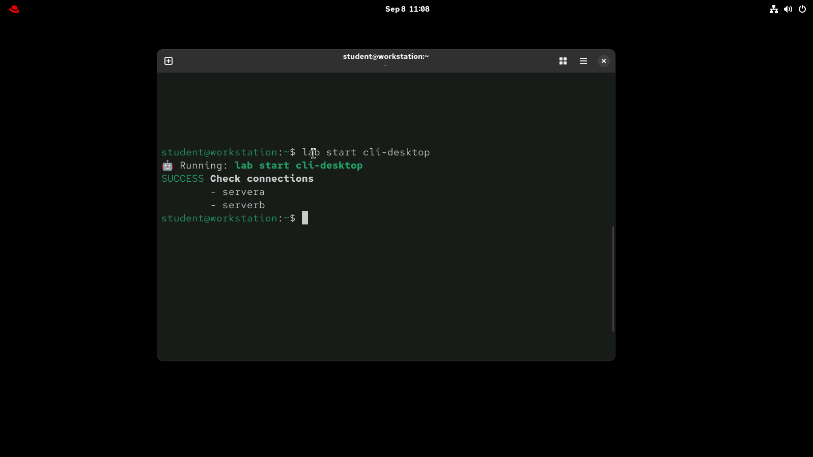
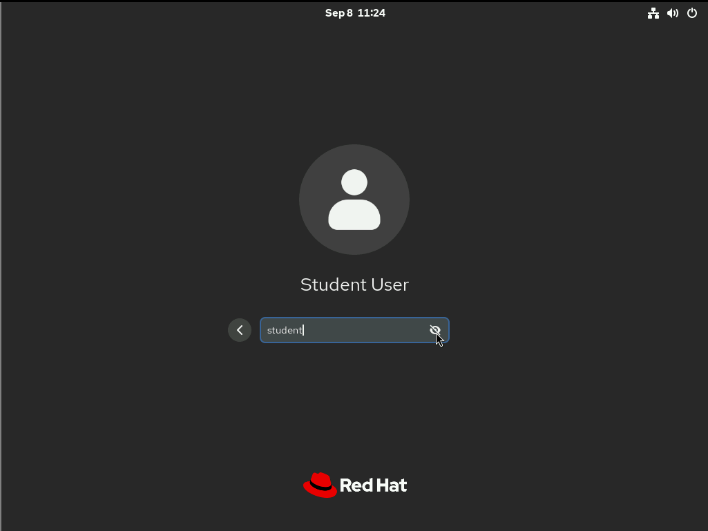
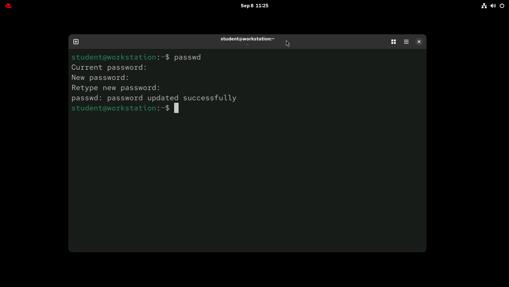
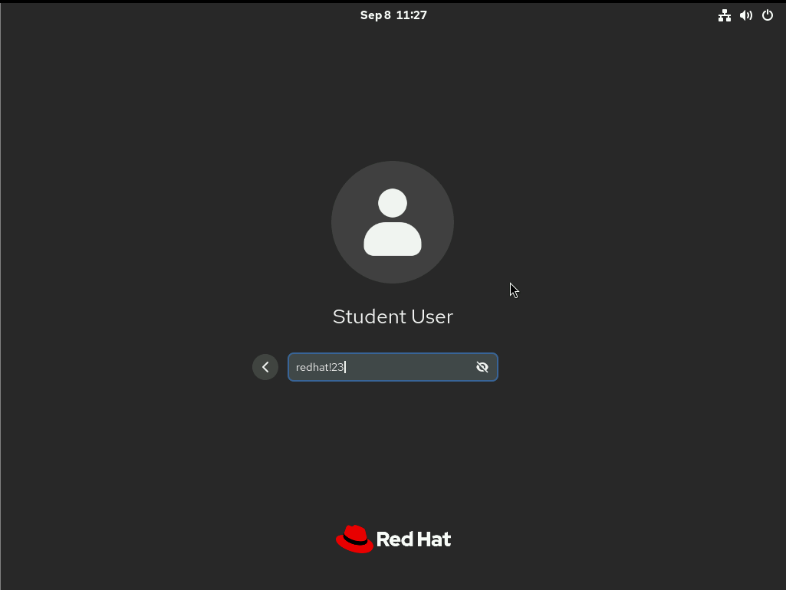
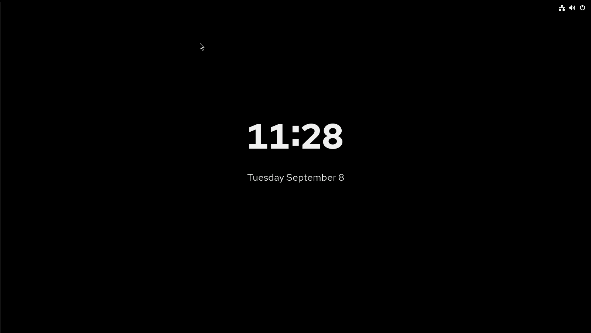
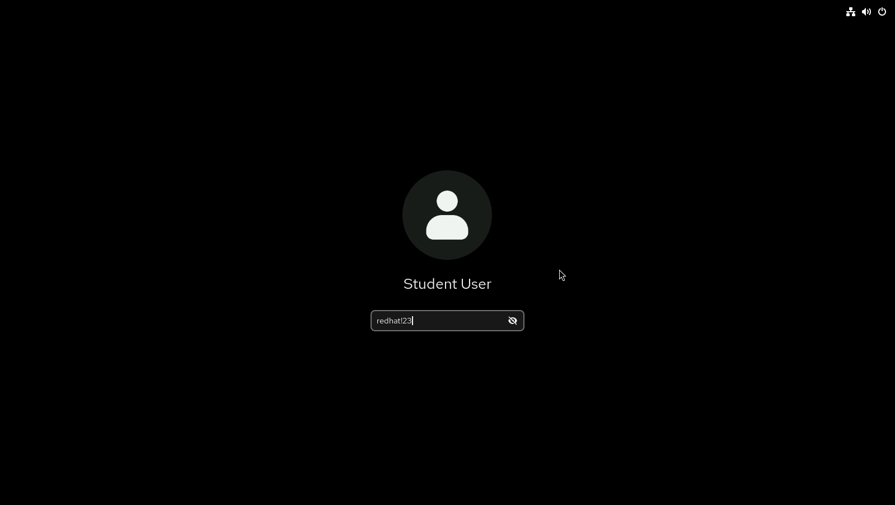
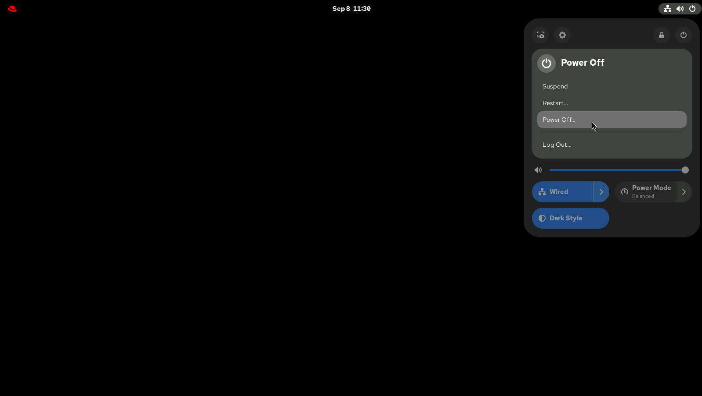
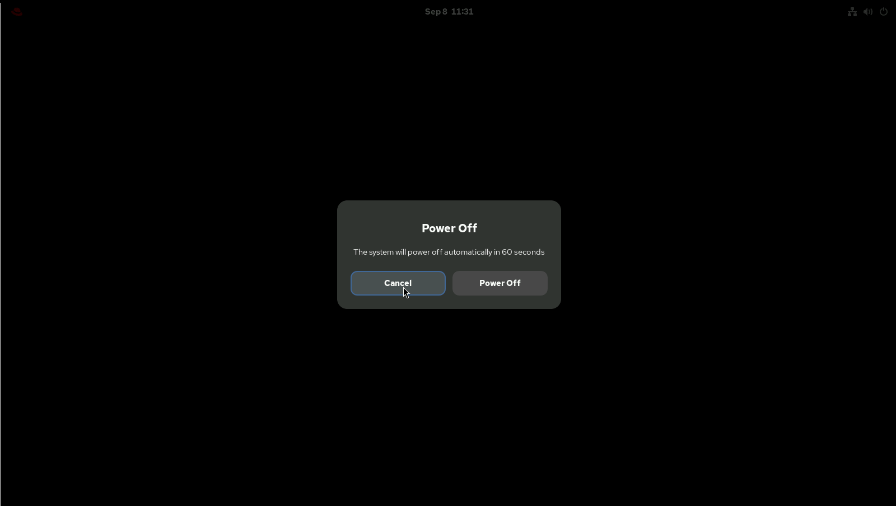
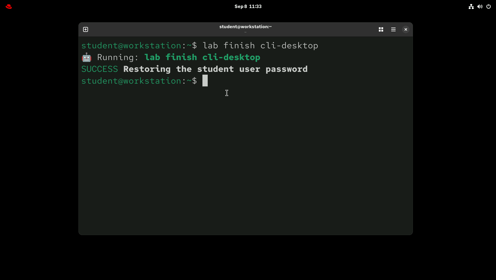

# Guided Exercise: Access the Command Line with the Desktop Environment

## Author

**Eng. Adel Shata**

---

### 1. Log in to a Linux system with the GNOME desktop environment and run commands from a shell prompt in a terminal program.

---

### 2. Log out of the GNOME desktop, then log in to the workstation machine as the student user with student as the password.

---

### 3. Use the terminal to change the password for the student user from student to redhat!23.

---

### 4. Log out of the GNOME desktop, and then log back in as the student user with redhat!23 as the password, to verify the changed password.

---

### 5. Lock the screen.

---

### 6. Unlock the screen.

---

### 7. Determine how to shut down the workstation machine from the graphical interface, but cancel the operation without shutting down the system.

---

### 8. Open a terminal and use the following lab command to finish the exercise.

---
