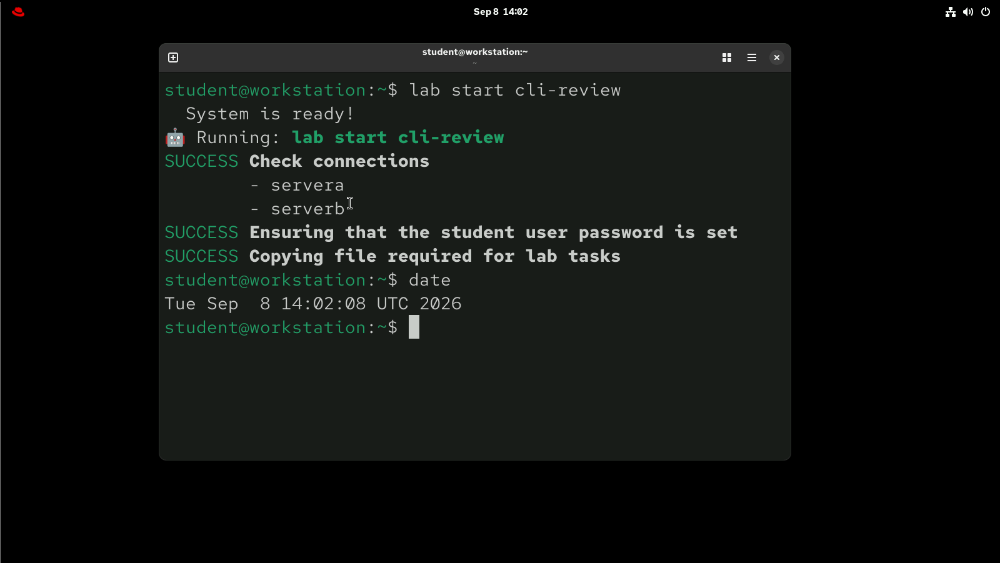
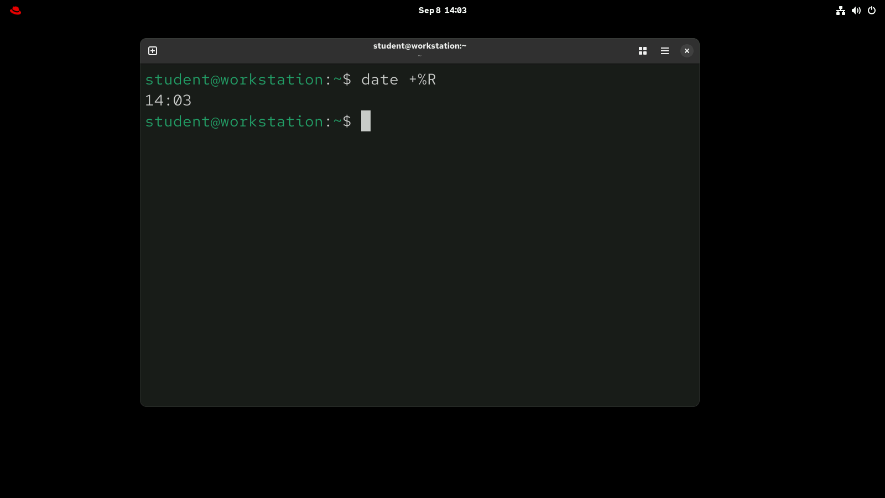
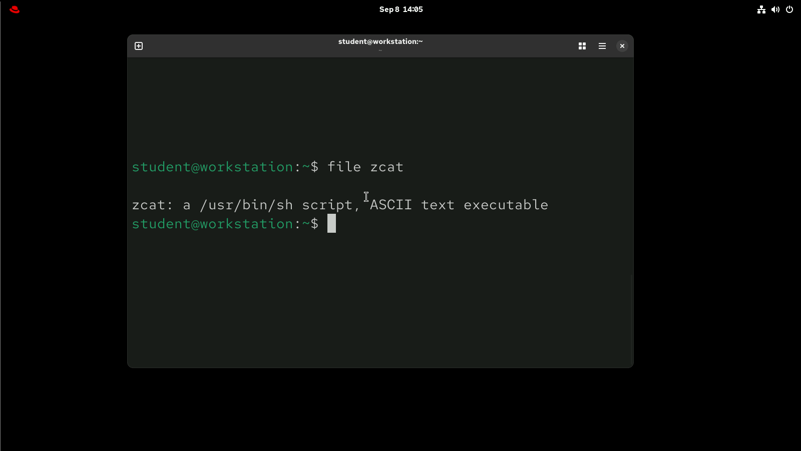
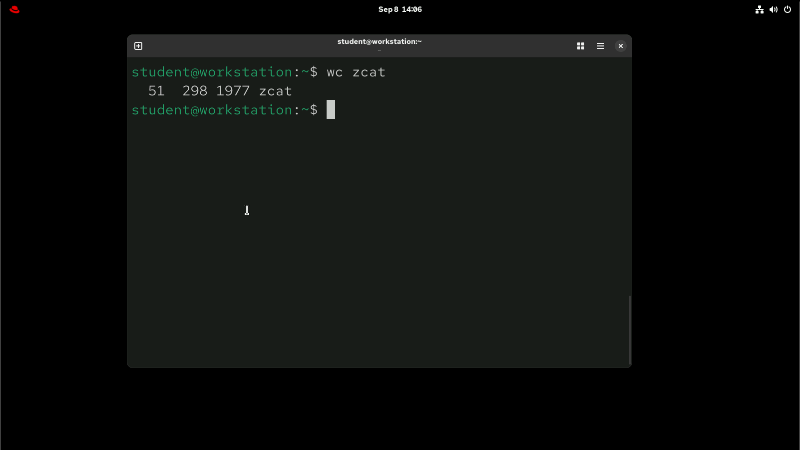
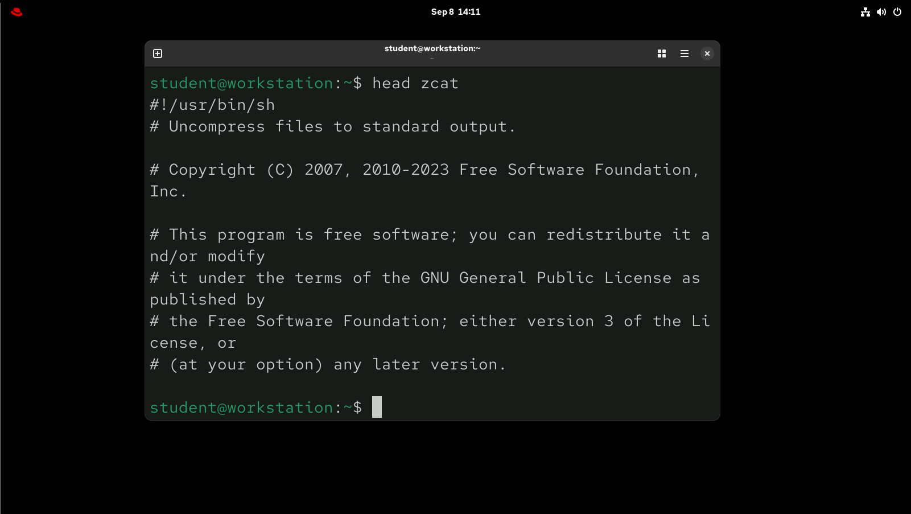
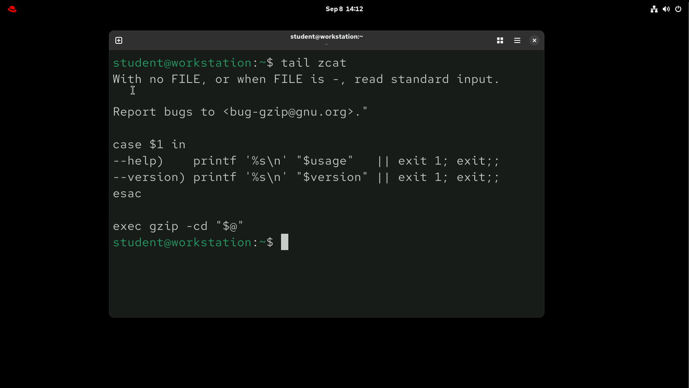
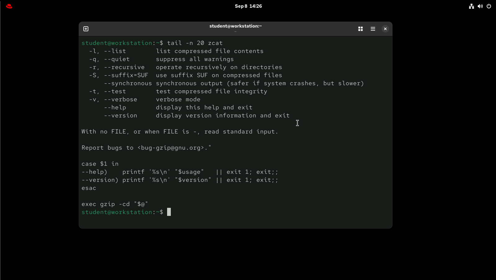
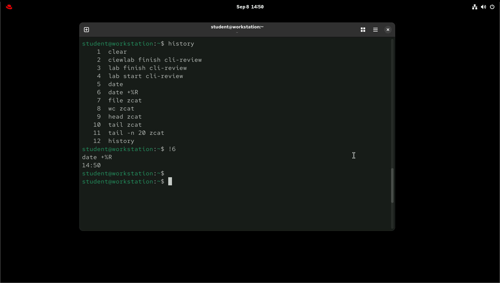

# Lab: Access the Command Line

## Author

**Eng. Adel Shata**

<a href="https://github.com/Adel-Shata"></a>
<a href="https://www.linkedin.com/in/adel-shata-a1b9a7376/"></a>
<a href="mailto:adel.shata.eng@gmail.com"></a>

---

### 1. Use a command to display the current time and date.



---

### 2. Display the current time in 24-hour clock time (for example, 13:57). Hint: The format string that displays that output is %R.



---

### 3. What kind of file is /home/student/zcat? Is it readable by humans?



---

### 4. Use the wc command and Bash shortcuts to display the size of the zcat file.



---

### 5. Display the first 10 lines of the zcat file.



---

### 6. Display the last 10 lines of the zcat file.



---

### 7. Repeat the previous command exactly with four or fewer keystrokes.

**Get the previous commant using ↓↓**

```bash
student@workstation:~$ UpArrow key
```
**Or by using ↓↓**

```bash
student@workstation:~$ !!
```
**Then press enter to repeat it ↓↓**


---

### 8. Use the tail command -n 20 option to display the last 20 lines in the zcat file. Use command-line editing to accomplish this task with a minimal number of keystrokes.

**Get the previous commant using ↓↓**

```bash
student@workstation:~$ UpArrow key
```
**→ Move the cursor to the beginning of the line pressing** ``Ctrl+A``
<br>

**→ jump to the next word pressing** ``Ctrl+RightArrow``
<br>

**→ Add the** ```-n 20``` **option and press** ``Enter`` **to execute the command.**



---

### 9. Use the shell history to run the date +%R command again.

**Display the history using ↓↓**

```bash
student@workstation:~$ UpArrow key
```
**Then choose the command to execute ↓↓**




