# Guided Exercise: Get Help from Manual Pages

## Author

**Eng. Adel Shata**

<a href="https://github.com/Adel-Shata"></a>
<a href="https://www.linkedin.com/in/adel-shata-a1b9a7376/"></a>
<a href="mailto:adel.shata.eng@gmail.com"></a>

---

### 1. As the student user on the workstation machine, open the default manual page for the man command.

**Open the default manual page for the man command using ↓↓**

```bash
student@workstation:~$ man man
```

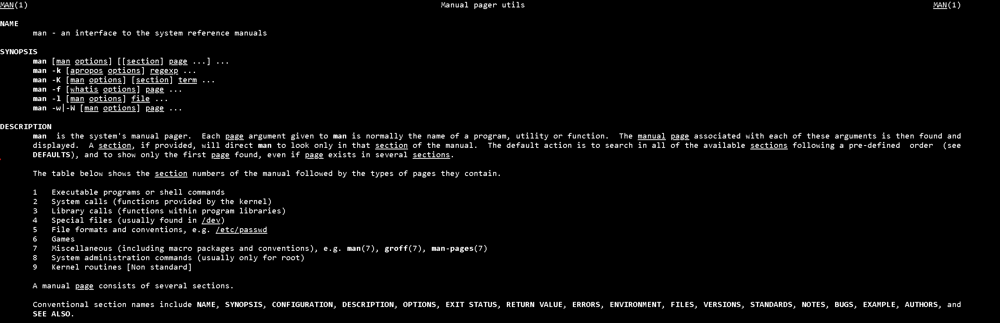

**Press** ``Q`` **to quit the man page.**
---

### 2. Open the manual pages for the passwd command and the /etc/passwd file format.

**2.1. Open the manual page for the** ``passwd`` **command using ↓↓**

```bash
student@workstation:~$ man passwd
```

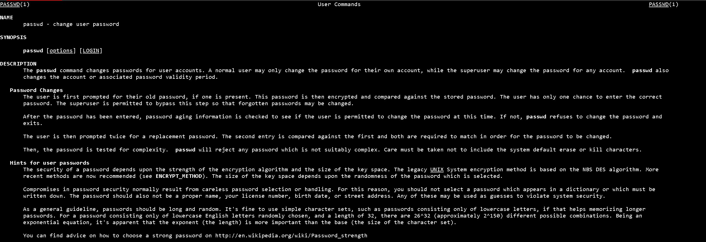

**Press** ``Q`` **to quit the man page.**

**2.2. **Open the manual page for the** ``passwd`` **file format. Make sure to specify the 5 option to request the file format manual page.**

```bash
student@workstation:~$ man 5 passwd
```

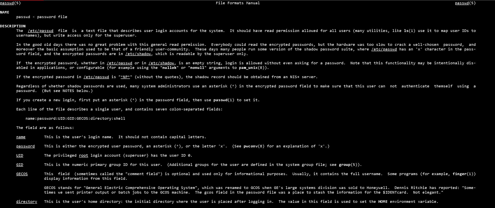

**Press** ``Q`` **to quit the man page.**


---

### 3. Open the su command man page. Review the default behavior of the command, and what the single dash option (-) does.

```bash
student@workstation:~$ man passwd
```

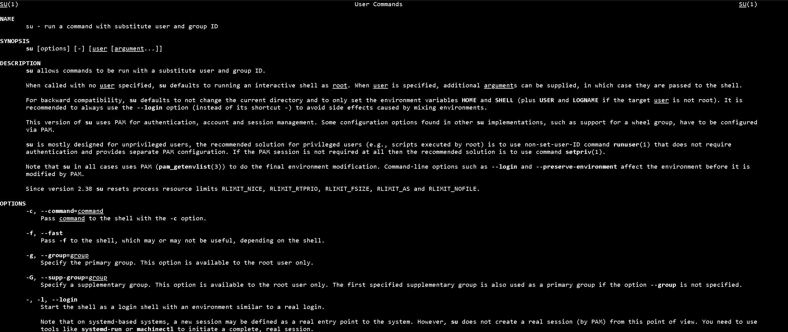

**Press** ``Q`` **to quit the man page.**

---

### 4. Find the man page with detailed information about the zip command.

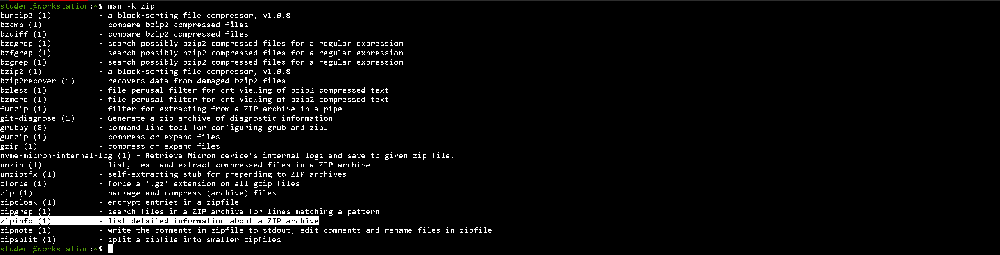

---

### 5. Find the man page with a list of parameters that can be passed to the kernel at boot time.

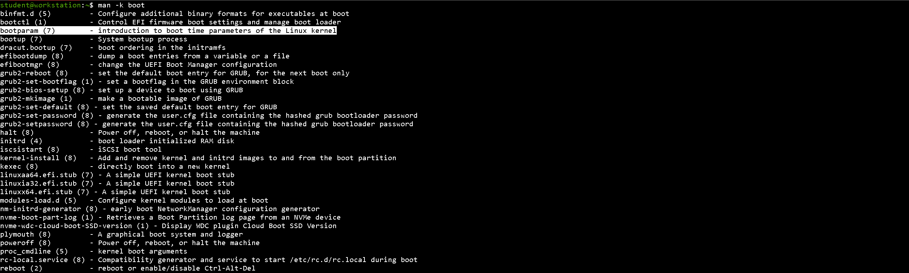

---

### 6. Find the command to tune ext4 file-system parameters.

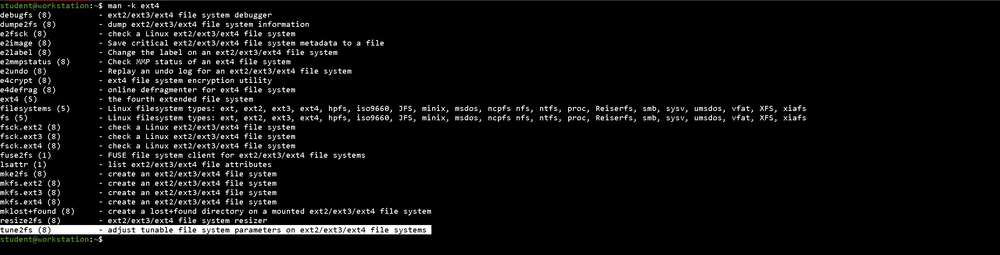

---

### 7. Use the man -f command to display a one-line description of the w command.

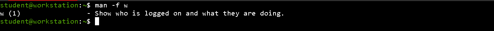

---

### 8. Open the man page for the vi command. Review the options for editing a specific file with the Vim text editor from the command line.

**8.1. Open the** ``vi`` **man page using ↓↓**

```bash
student@workstation:~$ man vi
```

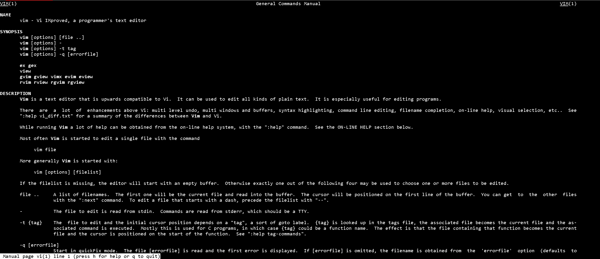

**8.2. In the** ``vi`` **man page, review the options for editing a specific file from the command line.**

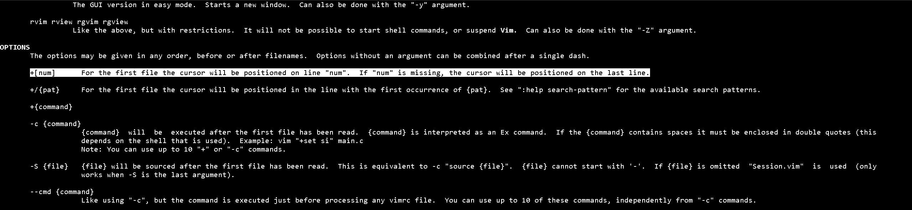

**Press** ``Q`` **to quit the man page.**

**8.3. Use the** vi ``+2 manual`` **command to open the manual file with the cursor at the second line.**

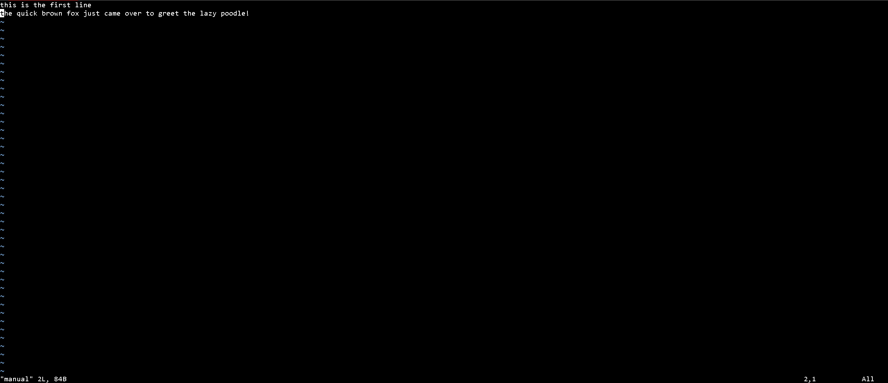

**Enter the** ``:q`` **command to exit.**
