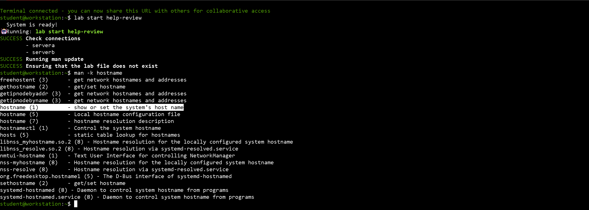
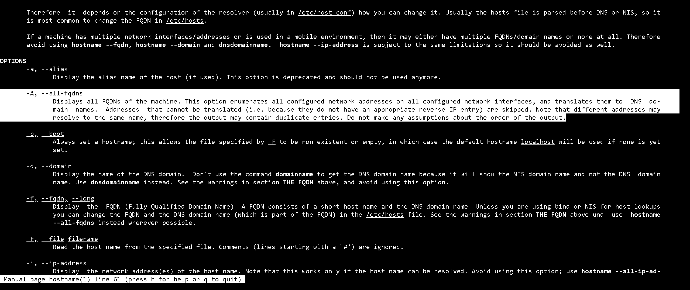
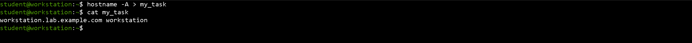
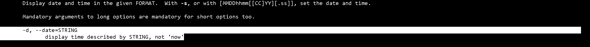
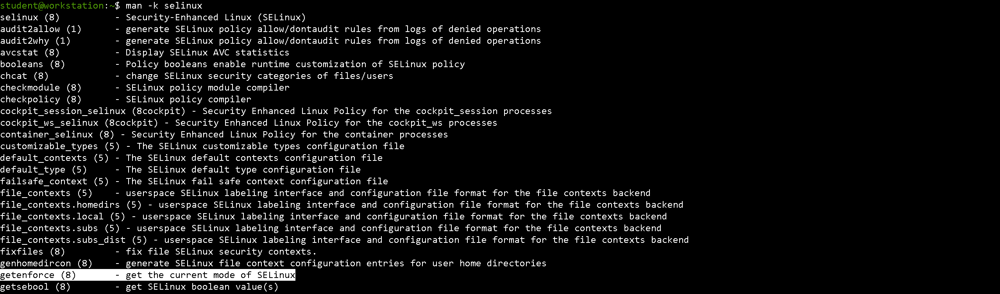
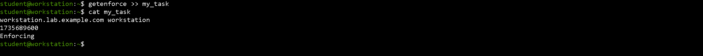
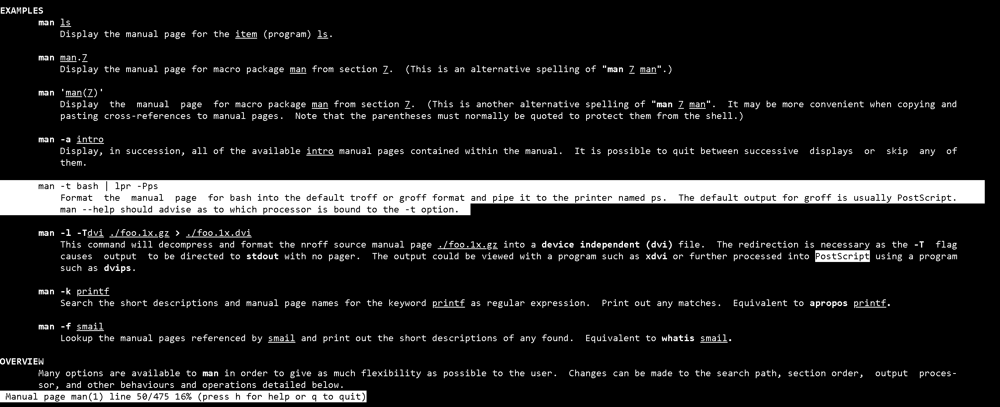
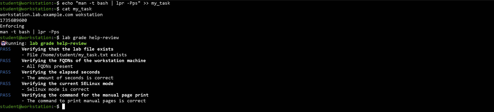

# Lab: Get Help from Local Documentation

## Author

**Eng. Adel Shata**

---

### 1. Search for and open the manual page for the hostname command. Find the command option to display all the fully qualified domain names (FQDNs) of the machine. Then, run the hostname command with the option to print all FQDNs and send the output to the my_task.txt file.

**1.1. Search for man pages that contain the hostname string to find the man page for the hostname command.**

**1.2. Open the man page of the hostname command using** ``student@workstation:~$ man hostname`` **and then search for the option that displays all the** ``FQDNs`` **of the machine.**

**(1.3, 1.4). Use redirection with the hostname command** ``-A`` **option to add the machine's FQDN hostnames to the** ``my_task.txt`` **file.**

---

### 2. Open the manual page of the date command. Find the option to help you to determine how many seconds have passed between January 1, 1970, and January 1, 2025. Run the command and append the output to the my_task.txt file.

**2.1. Browse the manual page for the date command to find the appropriate option.**

**(2.2, 2.3). Use the date command with the** ``-d`` **and** ``%s`` **options to get the number of seconds between the requested dates. Append the output of the command to the** ``my_task.txt`` **file.**
**Then Verify that the my_task.txt file contains the required information.**

---

### 3. Find the manual page of the command that identifies the current SELinux mode of the workstation machine. Run the command and append the output to the my_task.txt file.

**3.1. Find the command that displays the current SELinux mode.**

**(3.2, 3.3). Use the** ``getenforce`` **command to get the current SELinux mode and add it to the** ``my_tasks.txt`` **file. Verify that the** ``my_task.txt`` **file contains the required information.**

---

### 4. Open the manual page of the man command. Find information about how to print a manual page with PostScript. Append the command, not the output, to the my_task.txt file.

**4.1. Use the** ``man man`` **command to determine how to prepare a manual page for printing.**

**Press Q to quit the man page.**

**(4.2, 4.3). Use the echo command to add the** ``man`` **command with the appropriate options to the** ``my_tasks.txt`` **file. Verify that the ``my_task.txt`` **file contains the required information.**

