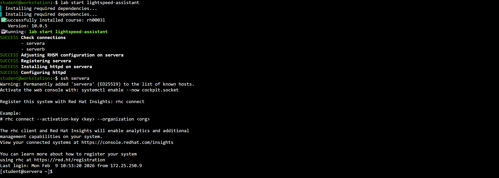
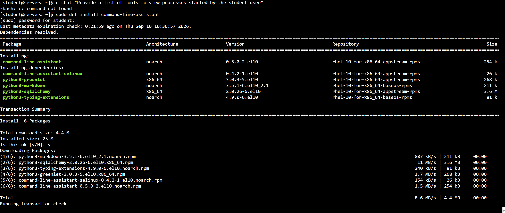
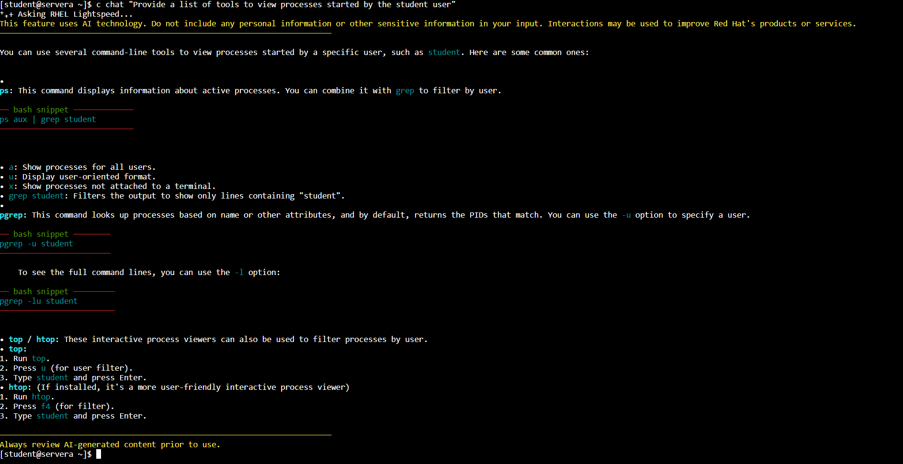
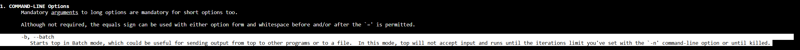
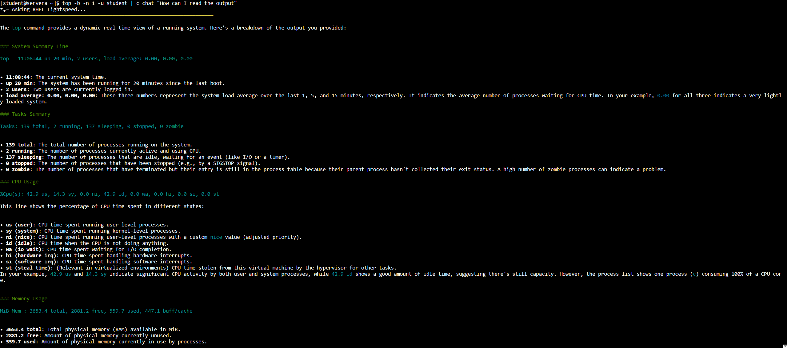
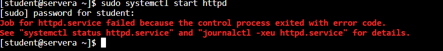
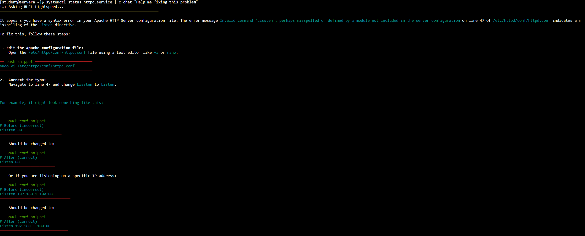
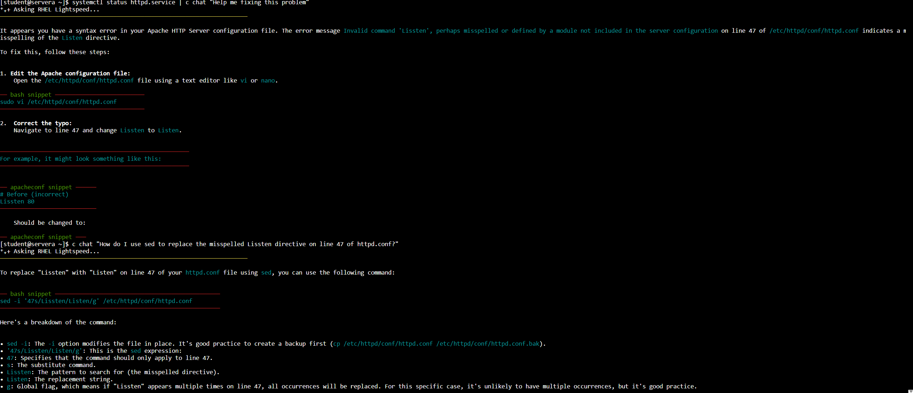
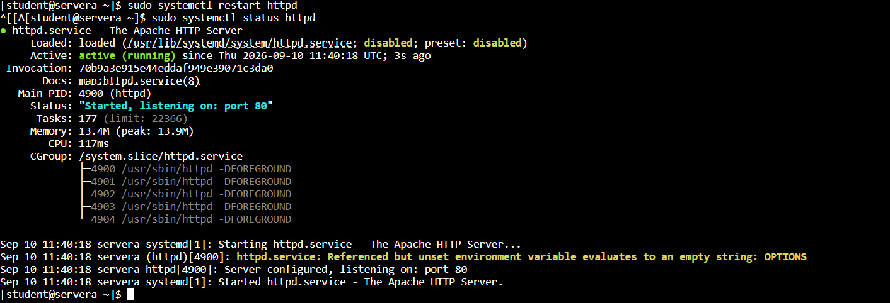
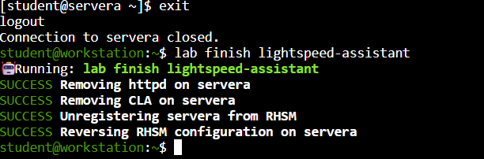

# Guided Exercise: Ask Questions and Evaluate Answers from the Command-line Assistant

## Author

**Eng. Adel Shata**

<a href="https://github.com/Adel-Shata"></a>
<a href="https://www.linkedin.com/in/adel-shata-a1b9a7376/"></a>
<a href="mailto:adel.shata.eng@gmail.com"></a>

---

### 1. Log in to the ``servera`` machine as the student user.



---

### 2. Install the command-line assistant on the servera machine using ↓↓.

```bash
student@workstation:~$ sudo dnf install command-line-assistant
```



---

### 3. Ask the command-line assistant for tools that can list processes that are running under the student user.


---

### 4. Following the instructions that the command-line assistant provides, run the ``top`` command to list the processes run by the student user. Pipe the top command output to the command-line assistant, and ask the command-line assistant to explain the output.

**(4.1, 4.2). Using ``man top`` to check how to pipe to output to another process without issues.**




**4.3. Ask the command-line assistant to explain the output.**



*****

---

### 5. Troubleshoot and resolve an issue with the web server (the httpd service) by using the command-line assistant.

**5.1. Use the ``sudo systemctl start`` command to try to start the web server. Use student as the password.**



**5.2. Ask the command-line assistant to help interpret the failure messages so that you can troubleshoot why the httpd service failed to start.**



**5.3. Ask the command-line assistant to provide a solution to the issue.**



**5.4. Fix the syntax error in the ``/etc/httpd/conf/httpd.conf`` file by using the solution that the command-line assistant provides. Use student as the password.**


**(5.5, 5.6). Restart the ``httpd`` service. Use student as the password. Verify that the httpd service started successfully.**


---

### 6. Return to the workstation machine as the student user.



